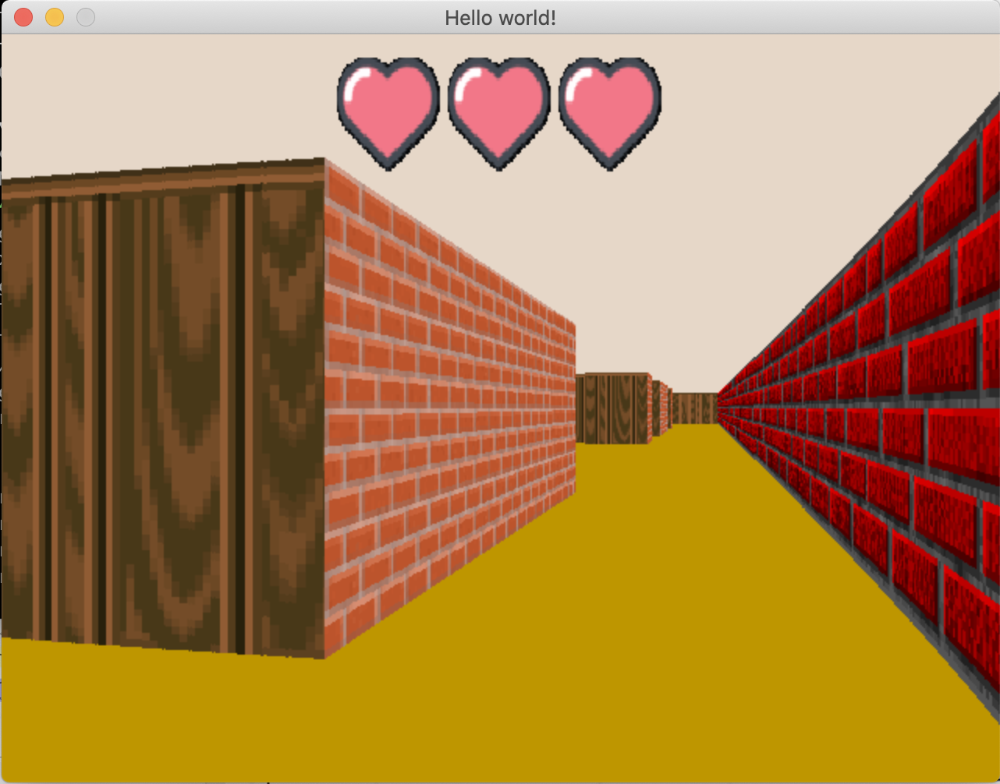
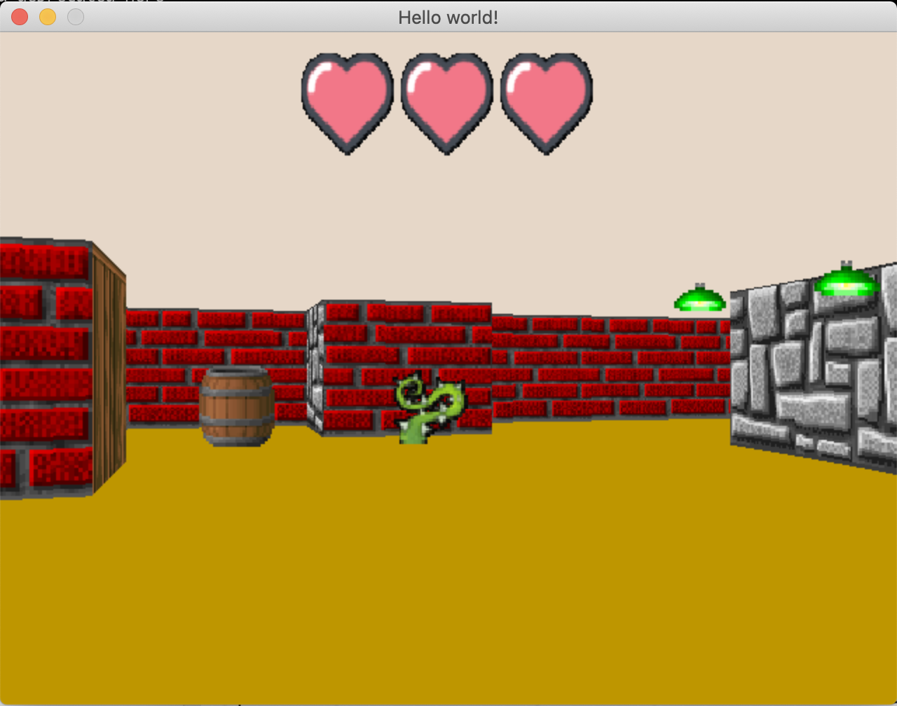

# cub3d
Raycaster inspired by the world-famous Wolfenstein game.
It shows a dynamic 3D graphical representation of the inside
of a maze from a first-person perspective.

**Usage:**
1. clone repo
2. run `make` from the root of the project
3. execute programme with: `./cub3D <mapfilename>`. There are some
example maps in the `test_maps` directory.

**How to interact with FdF:**
* `W`, `A`, `S` and `D` keys to move around the map.
* `left arrow` and `right arrow` to look around.
* `esc` to quit programme.

## Examples





## Map specifications:
Map configuration files have a `.cub` extension.

Here is a valid map file example:
```
NO ./path_to_the_north_texture
SO ./path_to_the_south_texture
WE ./path_to_the_west_texture
EA ./path_to_the_east_texture

F 220,100,0
C 225,30,0

        1111111111111111111111111
        1000000000110000000000001
        1011000001110000000000001
        1001000000000000000000001
111111111011000001110000000000001
100000000011000001110111111111111
11110111111111011100000010001
11110111111111011101010010001
11000000110101011100000010001
10000000000000001100000010001
10000000000000001101010010001
11000001110101011111011110N0111
11110111 1110101 101111010001
11111111 1111111 111111111111
```
* The map must be composed of only 6 possible characters: 0 for an
empty space, 1 for a wall, and N,S,E or W for the player’s start
position and spawning orientation.
* The map must be closed/surrounded by walls.
* Specify North texture: `NO ./path_to_the_north_texture`
* South texture: `SO ./path_to_the_south_texture`
* East texture: `EA ./path_to_the_east_texture`
* West texture: `WE ./path_to_the_west_texture`
* Floor colour: `F <RGB color>`
* Ceiling colour: `C <RGB color>`
